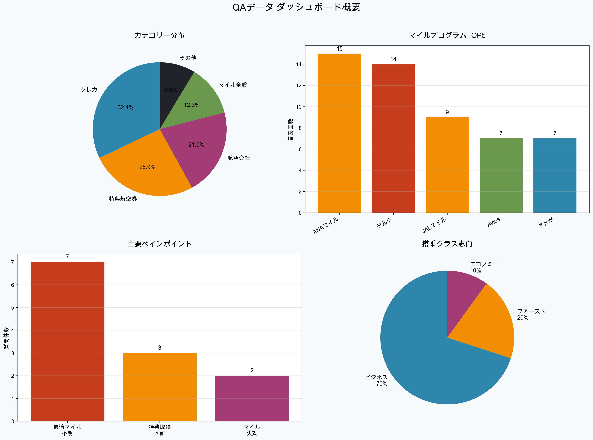
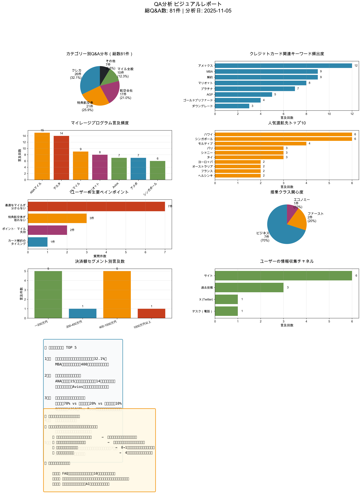

# 📊 QA 分析 ビジュアルレポート

**分析日**: 2025 年 11 月 5 日
**データソース**: QA まとめ 20251013(1).xlsx
**総 Q&A 数**: 81 件

---

## 🎯 エグゼクティブサマリー



この QA データベースには、マイル・クレジットカード・特典航空券に関する実ユーザーからの 81 件の質問と専門家による回答が収録されています。

### 🔑 キーファインディング

| 項目                   | 数値                             | インサイト                   |
| ---------------------- | -------------------------------- | ---------------------------- |
| **最多カテゴリー**     | クレカ 32.1%                     | カード戦略が最大の関心事     |
| **最大ペインポイント** | 最適マイル不明 7 件              | 情報過多による混乱           |
| **外資マイル注目度**   | ANA マイル 15 回 vs デルタ 14 回 | 外資マイルへのシフト         |
| **クラス志向**         | ビジネス 70%                     | ビジネスクラスへの圧倒的関心 |
| **決済額ホットゾーン** | 400 万円                         | MBA 継続判断の分岐点         |

---

## 📈 詳細分析

### 1️⃣ カテゴリー別 Q&A 分布

カテゴリー別の質問分布から、ユーザーが最も関心を持つテーマが明らかになりました。

**カテゴリー構成**

- 🏦 **クレジットカード**: 26 件（32.1%）← 最多
- ✈️ **特典航空券・ルート**: 21 件（25.9%）
- 🛫 **特定の航空会社**: 17 件（21.0%）
- 💳 **マイル全般**: 10 件（12.3%）
- 📋 **その他**: 7 件（8.6%）

> **インサイト**: クレジットカード関連が全体の 3 割以上を占め、ユーザーの最大の関心事は「どのカードを選び、どう運用するか」という戦略的な判断に集中しています。

---

### 2️⃣ クレジットカード戦線の変化



#### 頻出キーワード TOP 8

1. **アメックス** - 12 回
2. **MBA（マリオット）** - 9 回
3. **解約** - 9 回 ← 注目
4. **マリオット** - 8 回
5. **プラチナ** - 7 回
6. **AGP** - 5 回
7. **ゴールドプリファード** - 4 回
8. **ダウングレード** - 3 回

#### 🎯 ビジネスインプリケーション

**MBA（マリオットボンヴォイアメックス）の転換期**

- 年会費値上げにより、ユーザーが代替カードを模索
- 「解約」が 9 回言及 = 高い離脱リスク
- **400 万円決済**がプラチナ継続の分岐点
- マリオットのライトユーザーは一般カードへのダウングレードを検討

**機会**: カード比較ガイド、決済額別最適戦略チャートの需要大

---

### 3️⃣ マイレージプログラムの勢力図

#### 言及頻度ランキング

| 順位 | プログラム       | 言及回数 | トレンド      |
| ---- | ---------------- | -------- | ------------- |
| 1    | ANA マイル       | 15 回    | 🔵 従来の王道 |
| 2    | デルタマイル     | 14 回    | 🔴 急上昇中   |
| 3    | JAL マイル       | 9 回     | 🔵 安定       |
| 4    | マリオット       | 8 回     | 🟡 ホテル系   |
| 5    | Avios            | 7 回     | 🔴 注目株     |
| 6    | アメポ           | 7 回     | 🟡 ポイント系 |
| 7    | シンガポール航空 | 6 回     | 🟢 優良       |

#### 💡 戦略的インサイト

**外資マイルへのパラダイムシフト**

- ANA マイル（15 回）とデルタマイル（14 回）がほぼ同数
- 「デルタ一択」「Avios 一択」という強い推奨表現
- 理由：特典枠の取りやすさ、有効期限なし、使い勝手

**推奨パターンの明確化**

- 🇫🇷 **パリ** → デルタマイル一択
- ✈️ **Q スイート** → Avios 一択
- 🏝️ **モルディブ** → シンガポール航空
- 🌏 **アジア圏** → 家族 4 人分も取りやすい

---

### 4️⃣ 渡航先トレンド分析

#### 人気渡航先 TOP 10

```
🏖️  ハワイ           ████████ 6回
🇸🇬  シンガポール     ████████ 6回
🏝️  モルディブ       ██████ 4回
🇫🇷  パリ             ████ 3回
🇦🇺  シドニー         ████ 3回
🇹🇭  タイ             ████ 3回
🇪🇺  ヨーロッパ       ██ 2回
🇦🇺  オーストラリア   ██ 2回
🇫🇷  フランス         ██ 2回
🇫🇮  ヘルシンキ       ██ 2回
```

#### 🌍 トレンド分析

**ビーチリゾート vs 都市型の二極化**

- ビーチリゾート：ハワイ、モルディブ
- 都市型：シンガポール、パリ、シドニー
- ヨーロッパへの関心は根強い

**家族旅行需要の高まり**

- 「4 人分」「2 人分」の予約が課題
- ファミリー登録の方法に関する質問
- アジア圏が現実的な選択肢として浮上

---

### 5️⃣ ユーザーのペインポイント

#### 主要な悩みランキング

```
❌ 最適なマイルが分からない       ████████████ 7件  👈 最大の悩み
❌ 特典航空券が取れない           ████ 3件
❌ ポイント・マイル失効           ██ 2件
❌ カード解約のタイミング         █ 1件
```

#### 🔍 深掘り分析

**1. 最適なマイルが分からない（7 件）**

- 情報の洪水の中で迷うユーザー
- 「どのマイルで取るべきか」
- 「どの航空会社がベストか」

**解決策のヒント**:

- 渡航先別マイルプログラム早見表
- フローチャート形式の診断ツール
- 実例ベースの具体的ガイド

**2. 特典航空券が取れない（3 件）**

- 「空きがない」「見つかりません」
- ANA や JAL はライバルが多い
- 外資マイルで差別化が必要

**3. ポイント・マイル失効（2 件）**

- 「35 万マイルが失効しそう」
- 使い切れない焦り
- 有効期限管理の難しさ

---

### 6️⃣ 搭乗クラス志向

#### クラス別関心度

```
🛫 ビジネスクラス    ██████████████ 70% (7件)
✨ ファーストクラス  ████ 20% (2件)
💺 エコノミー        ██ 10% (1件)
```

#### 💎 プレミアム座席への強い関心

**特定座席への言及**

- ✈️ **Q スイート**（カタール航空）
- 🎯 **A350 ビジネス**（JAL）
- 🌟 **The Room**（ANA）

**価値観**

- 「ビジネスクラスの方がマイル単価が高い」
- 「直行便 × ビジネス = 最強」
- 「時間価値を最重視」

> **インサイト**: エコノミーは「勿体無いか？」という質問形式で現れるが、ビジネスクラスへの関心が圧倒的（7 対 1）。マイル活用の目的は「プレミアム体験の獲得」に明確にシフトしています。

---

### 7️⃣ 決済額セグメント分析

#### ユーザー層の分布

```
💰 〜200万円         ██████ 5件     初心者層
💰 200-400万円       ██ 1件         AGP活用層
💰 400-1000万円      ██████ 5件     MBA継続判断層  👈 ホットゾーン
💰 1000万円以上      ██ 1件         プレミアム層
```

#### 🎯 セグメント別インサイト

| セグメント    | 特徴               | 主要な悩み     | 推奨施策               |
| ------------- | ------------------ | -------------- | ---------------------- |
| 〜200 万円    | 初心者、カード選定 | 何から始めるか | 初心者向けロードマップ |
| 200-400 万円  | AGP 活用           | ポイント最適化 | AGP 最大活用ガイド     |
| 400-1000 万円 | MBA 継続判断       | カード乗り換え | 決済額別カード診断     |
| 1000 万円以上 | プレミアムカード   | 上級者向け特典 | VIP カード比較         |

**400 万円**が最も多く言及される金額であり、これが**MBA プラチナ継続の分岐点**となっています。

---

### 8️⃣ 情報収集チャネル

#### ユーザーはどこから情報を得ているか

```
🌐 サイト           ████████ 6回
📝 過去投稿         ████ 3回   👈 自社コンテンツへの誘導
🐦 X (Twitter)      ██ 1回
☎️  デスク（電話）   ██ 1回
```

#### 📊 コンテンツ戦略への示唆

**「過去投稿を参考に」が頻出**

- 同じような質問が繰り返されている
- FAQ 化・検索機能の強化が必要
- アーカイブコンテンツの価値が高い

**機会**:

1. よくある質問 TOP10 の FAQ 作成
2. 検索しやすいナレッジベース構築
3. 渡航先別・カード別のクイックガイド

---

## 💡 ビジネス機会とアクションアイテム

### 🎯 コンテンツギャップ（需要大 × 供給不足）

#### 1. カード解約・ダウングレード判断フロー

**需要**: 「解約」9 回言及、「ダウングレード」3 回言及

**提案コンテンツ**:

```
年間決済額別カード戦略チャート
├─ 〜200万円 → AGP or 一般カード
├─ 200-400万円 → AGP継続
├─ 400-1000万円 → MBA vs AGP 診断
└─ 1000万円以上 → プレミアムカード比較
```

#### 2. 渡航先別マイルプログラム早見表

**需要**: 「最適なマイルが分からない」7 件

**提案コンテンツ**:
| 渡航先 | 推奨マイル | 必要マイル数 | 燃油代 | 取りやすさ |
|--------|-----------|------------|-------|----------|
| パリ | デルタ | 85,000 | $$ | ⭐⭐⭐⭐⭐ |
| モルディブ | シンガポール | 63,000 | $ | ⭐⭐⭐⭐ |
| ハワイ | JAL/ANA | 40,000 | $$$ | ⭐⭐⭐ |

#### 3. 初心者向けロードマップ

**需要**: 初心者関連 Q&A 4 件、「何から学ぶべきか」

**提案コンテンツ**:

```
マイル初心者 3ステップガイド

【STEP 1】最初の1枚を選ぶ（1ヶ月目）
  └─ AGP or JALカード診断

【STEP 2】最初のマイルを貯める（2-6ヶ月目）
  └─ 決済戦略とポイントサイト活用

【STEP 3】最初の特典航空券を取る（6-12ヶ月目）
  └─ 取りやすいルートからチャレンジ
```

#### 4. 家族旅行特化ガイド

**需要**: 家族旅行関連 5 件、「4 人分」「2 人分」

**提案コンテンツ**:

- ファミリー登録完全マニュアル
- 4 人分を取りやすいルート TOP10
- 家族旅行向けマイルプログラム比較

---

### 🚀 推奨アクションアイテム

#### 短期施策（1-3 ヶ月）

✅ **FAQ 化**

- 「過去投稿を参考に」と言われる質問 TOP10 をまとめる
- 検索しやすいアーカイブ構築

✅ **カード比較表の作成**

- AGP vs MBA vs ANA アメックス
- 決済額別の最適カード診断チャート

✅ **渡航先別クイックガイド**

- 人気 10 都市の「このマイル一択」まとめ
- 1 ページで完結する早見表

#### 中期施策（3-6 ヶ月）

✅ **初心者向けオンボーディング**

- 0 からのロードマップコンテンツ
- 最初の 1 枚のカード選定フロー
- 動画・インフォグラフィック化

✅ **家族旅行特化コンテンツ**

- ファミリー登録完全マニュアル
- 4 人分取りやすいルート特集
- 子連れ旅行の実例集

✅ **コミュニティ機能**

- 同じような質問の集約
- ユーザー同士の情報交換促進
- Q&A 投稿機能

#### 長期施策（6-12 ヶ月）

✅ **パーソナライゼーション**

- 決済額・旅行スタイル別のレコメンド
- ユーザープロファイル機能
- カスタマイズされた通知

✅ **AI 活用の最適ルート提案**

- 条件入力で最適マイルを自動提案
- 特典航空券の空席アラート
- マイル有効期限管理ツール

✅ **マネタイズ戦略（任意）**

- プレミアム会員制度
- 個別コンサルティング
- 代行サービス

---

## 📈 KPI 設定提案

ビジネス成長を測定するための KPI 案：

| KPI                    | 現状 | 目標（3 ヶ月後） | 目標（6 ヶ月後） |
| ---------------------- | ---- | ---------------- | ---------------- |
| FAQ 化された質問数     | 0 件 | 20 件            | 50 件            |
| 「過去投稿」への誘導率 | -    | 50%減            | 70%減            |
| 新規ユーザー獲得数     | -    | +30%             | +50%             |
| コンテンツ滞在時間     | -    | +25%             | +40%             |
| 問い合わせ重複率       | -    | -30%             | -50%             |

---

## 🎓 結論

### 主要発見事項

1. **カード戦略が最大の関心事**（32.1%）

   - MBA 年会費値上げ対応が急務
   - 400 万円が継続判断のライン

2. **外資マイルへのパラダイムシフト**

   - ANA マイルとデルタマイルがほぼ同数
   - 「一択」という強い推奨表現

3. **情報過多による混乱**

   - 「最適なマイルが分からない」が最大のペインポイント
   - FAQ 化とガイド整備が急務

4. **プレミアム体験への関心**

   - ビジネスクラス 70% vs エコノミー 10%
   - 特定座席（Q スイート、A350）への憧れ

5. **家族旅行需要の顕在化**
   - 4 人分の予約が課題
   - アジア圏が現実的選択肢

### 最大の機会

ユーザーは**情報の洪水の中で迷っています**。

この「迷い」を「確信」に変える、**信頼性の高い情報と実行可能なガイド**を提供することが、最大のビジネス機会です。

具体的には：

- ✅ 渡航先別マイルプログラム早見表
- ✅ 決済額別カード戦略チャート
- ✅ 初心者向け 3 ステップロードマップ
- ✅ 家族旅行特化ガイド

これらのコンテンツを提供することで、ユーザーの意思決定を支援し、エンゲージメントと満足度を大幅に向上させることができます。

---

**レポート作成**: Claude Code
**分析日**: 2025 年 11 月 5 日
**データソース**: QA まとめ 20251013(1).xlsx（81 件の Q&A）
